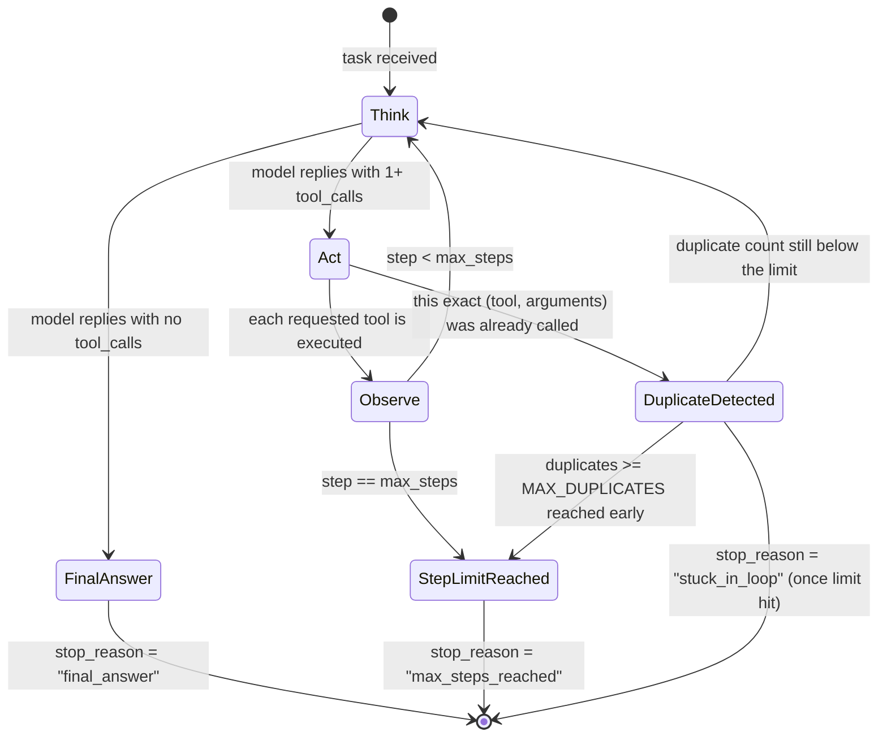

# Day 11: State diagram for `run_agent`

This is every state the loop can be in, and every way it moves between them.
Compare this against a real trace in `artifacts/day11_traces/` line by line.

## Each state, in plain words

- **Think**: `chat_fn(messages, tool_schemas)` is called. The model sees the
  whole conversation so far and decides: answer now, or ask for a tool.
- **Act**: your code, not the model, actually runs the requested tool(s) via
  `execute_tool(name, arguments)`.
- **Observe**: the tool's result is appended to `messages` as a `"tool"`
  message, so the next Think step can see it.
- **FinalAnswer**: the model replied with no `tool_calls`. This is the normal,
  successful ending. `stop_reason = "final_answer"`.
- **StepLimitReached**: `max_steps` think-act-observe cycles have happened
  without a final answer. `stop_reason = "max_steps_reached"`.
- **DuplicateDetected**: the exact same tool name and arguments were already
  requested once before in this run. If this happens `MAX_DUPLICATES` times,
  the loop stops early rather than waiting for the full step budget.
  `stop_reason = "stuck_in_loop"`.

## Why there are exactly 3 ways to stop

Every run of `run_agent` ends in exactly one of three states, and every one
of the three is tested directly in `tests/test_agent.py` and
`tests/test_alfred_tools.py`:

| Ending state | Meaning | Is this success? |
|---|---|---|
| FinalAnswer | The model had what it needed and answered | Yes |
| StepLimitReached | The model never managed to finish in time | No, but safe |
| DuplicateDetected (after limit) | The model got stuck repeating itself | No, but safe |

The important property for a production agent isn't "always succeeds", it's
"always terminates, even when it fails." A system that can hang forever is a
much bigger problem than one that sometimes gives up early.

## Exercise

Open one trace from `artifacts/day11_traces/task_1.json` (or any task) and,
for every entry in its `trace` list, write down which state it corresponds
to above. Then write down the run's final `stop_reason` and confirm it
matches one of the three ending states.
